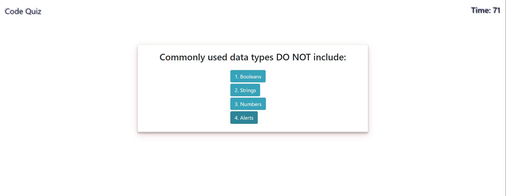

# Coding Quiz

## Depoyment

_[Click Here for the Deployed Application](https://sendymederos.github.io/Coding-Quiz/)_

## Technologies 

This application displays a coding quiz using APIs. 
To build this Web, it has been used HTML, JavaScript, BootStrap, and CSS.

## Instructions
 
When the quiz starts it displays the instructions and the start button.
When the quiz starts a timer starts to count down at the top right of the website and a series of questions and answers will display.
When an answer is selected a message of “right” or “wrong” appears for a second and a half, and it goes to the next question and possible answers. 
If the answer is incorrect, 10 seconds are deleted from the timer.
When all the questions are answered or the timer reaches 0, the game is over and you can save your initials. 
When scores are saved, past scores will display starting with the highest score.
Then an option of clearing the scores and restarting the game will appear at the bottom of the list. 

